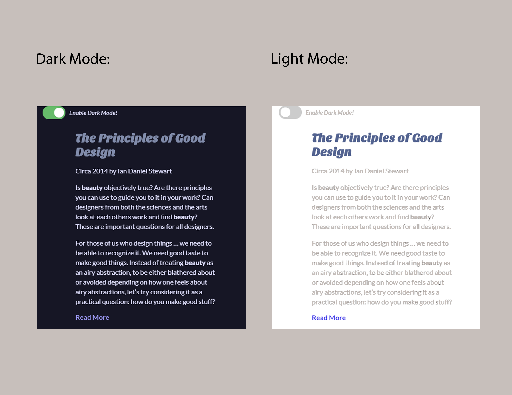
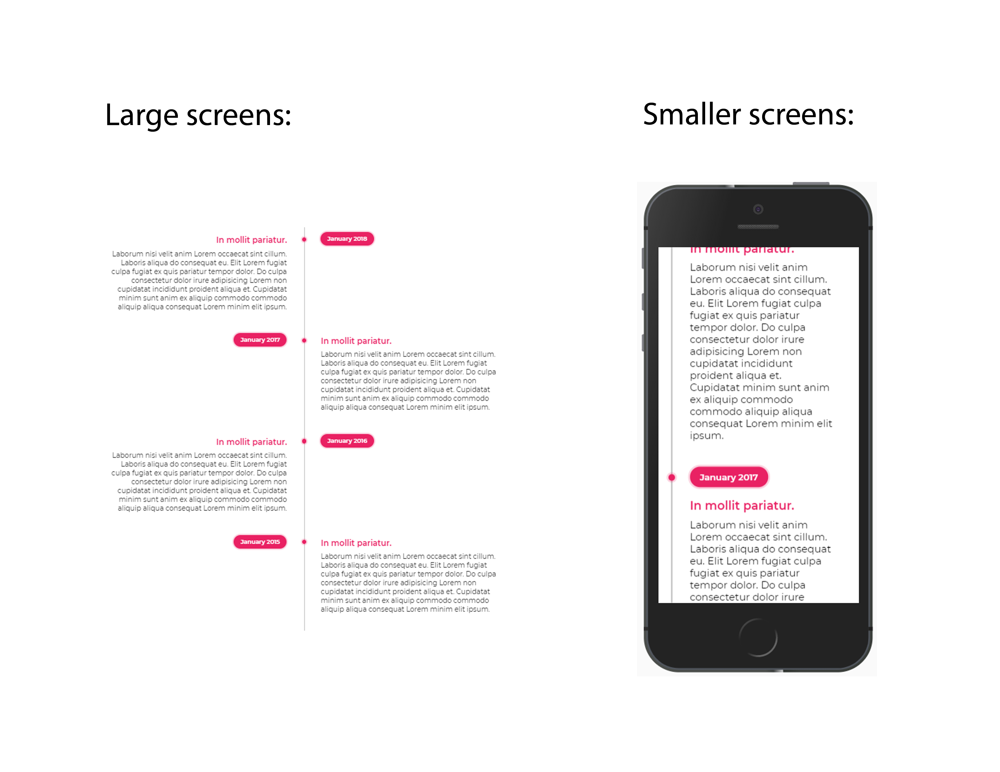

# html-css-practice
An assembly of html css practice code

## Folder: dark-light-mode:
- From tutorial, [dark/light mode](https://dev.to/ananyaneogi/create-a-dark-light-mode-switch-with-css-variables-34l8) by Ananya Neogi, to create dark/light mode switch using CSS variables
#### How to use:
- From index.html, run live server
- From main.scss, run "watch sass". Only edit main.scss, this is then translated to css in main.css.

## Folder: smooth-scroll:
From Traversy Media, implements smooth scroll in one of three ways:
#### 1. CSS: 
- includes both smooth scroll, and scroll snapping (scroll-snap-type, and scroll-snap-align)
- not compatible on safari, IE, or Opera

#### 2. JQuery (didn't work):
- imported jQuery CDN in index.html
- did not work, could not find this.hash in document

#### 3. Smooth Scroll CDN:
- imported smooth scroll CDN
- added line of code in main.js to implement only smooth scroll

## Folder: float-flexbox-grid:
From Lynda.com, "CSS Layouts: From Float to Flexbox and Grid" by Christina Truong:
#### How to use:
- In index.html, modify the stylesheet href link to the desired css file, to test float vs flexbox vs grid

## Folder: timeline:
- From Online Tutorials' course (Youtube) to create responsive css timelines

